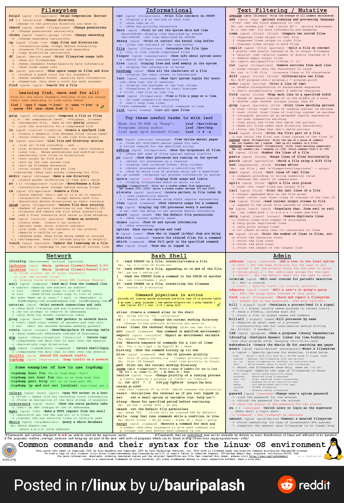

# UNIX filesystem

A file system is a hierarchical structure of files and directories. Some important directory of UNIX filesystem is given below...!

+ **/** : The slash / character alone denotes the root of the filesystem tree.
+ **/bin** : Stands for “binaries” and contains certain fundamental utilities, such as ls or cp, which are generally needed by all users.
+ **/home** : Contains the home directories for the users.
+ **/usr** : Originally the directory holding user home directories

*[UNIX command](https://en.wikipedia.org/wiki/List_of_Unix_commands), their syntax and usage can be easily found on the internet.* Some useful UNIX commands...

# Vim

Vim is a text editor for Unix. We can install vim by using
`sudo apt-get vim` and to open a file, type `vim <filename>` . Vim has 12 different editing modes, 6 of which are variants of the 6 basic modes. The most used and default mode is **normal mode**.

*Vim command and their usage...*

## Basics of moving in Vim

When you’re in command mode,

> + **h** moves the cursor one character to the left.
> + **j** moves the cursor down one line.
> + **k** moves the cursor up one line.
> + **l** moves the cursor one character to the right.
> + **0** moves the cursor to the beginning of the line.
> + **$** moves the cursor to the end of the line.
> + **w** move forward one word.
> + **b** move backward one word.
> + **G** move to the end of the file.
> + **gg** move to the beginning of the file.
 
## Saving and quiting

If you’re in insert mode, hit Escape. Then enter : and you’ll see a line at the bottom of the screen with a cursor ready to take input.

> + **:q!** exit without saving
> + **:w** save
> + **:wq** or **:x** save and exit
