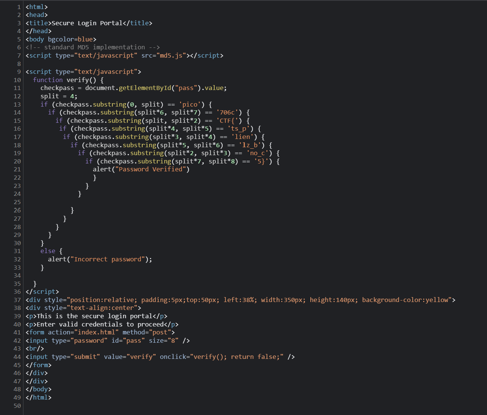

# dont-use-client-side

## Overview

Points: 100
Category: Web Exploitation

## Description

Can you break into this super secure portal? https://jupiter.challenges.picoctf.org/problem/17682/ or http://jupiter.challenges.picoctf.org:17682

## Hints

1) Never trust the client

## Approach

Since the title says not to use the client side, i went ahead and opened the inspect element and opened the index file in the sources tab and then i looked at the following snippet of the code

In the verify function I noticed the variable split assigned to 4 so each substring chech if block was assigned to split to split+4.
So arranging the codes in ascending order we get the flag

## Flag

picoCTF{no_clients_plz_b706c5}
