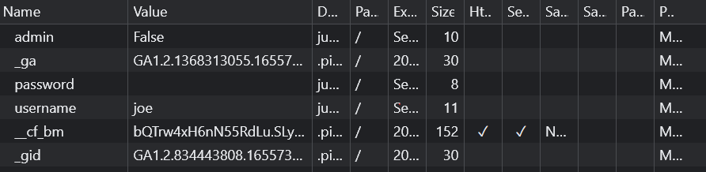

# logon

## Overview
1) Points:  100
2) Category: Web Exploitation

## Description

The factory is hiding things from all of its users. Can you login as Joe and find what they've been looking at? https://jupiter.challenges.picoctf.org/problem/44573/ (link) or http://jupiter.challenges.picoctf.org:44573

## Hints

1) Hmm it doesn't seem to check anyone's password, except for Joe's?

## Approach 

First after going throug the inspect element and finding nothing of particular interest, i went ahead with the first clue and entered joe as the username and joe as the password as a trial which took me to this page

After going through the developer tools again, i landed on the cookies page

I noticed that the admin was given a false vale and i thought that setting it to true might let me in and give me the flag. Luckily enough changing the value to true did indeed help and i got my flag

## Flag

picoCTF{th3_c0nsp1r4cy_l1v3s_0c98aacc}
