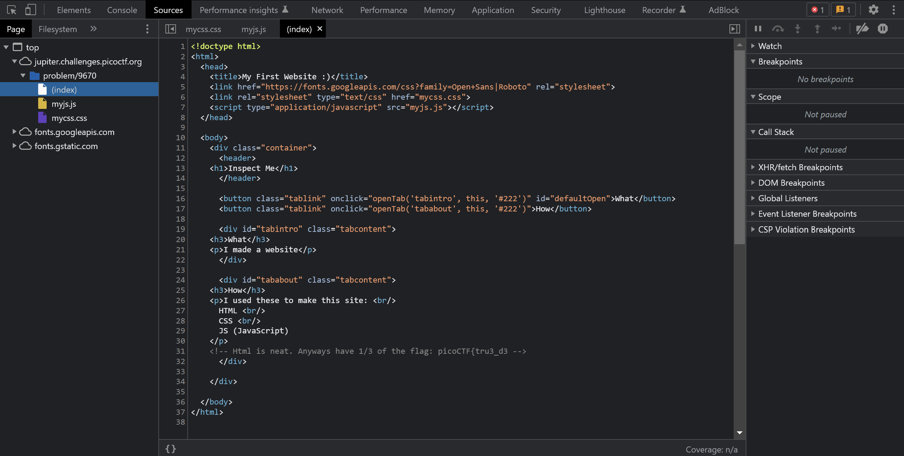
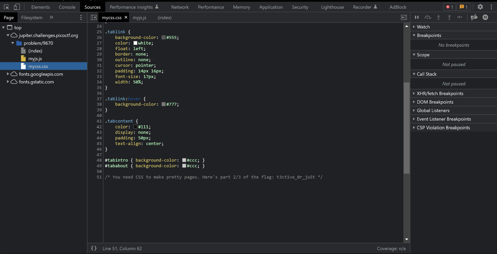

# Insp3ct0r

## Overview
Points: 50 Points
Category: Web Exploitation

## Description
Kishor Balan tipped us off that the following code may need inspection: https://jupiter.challenges.picoctf.org/problem/9670/ (link) or http://jupiter.challenges.picoctf.org:9670

## Hints
1) How do you inspect web code on a browser?
2) There's 3 parts

## Approach
From the first clue it can be easily made out that we need to use the inspect element feature, and the second hint implies that the flag is in three parts.

So just playing around in the developer tools, I landed in the sources tab, and each of the three files ((index), myjs.js and mycss.css) had each of the three parts of the flag hidden in the code

## Flag
picoCTF{r3j3ct_th3_du4l1ty_6ef27873}
