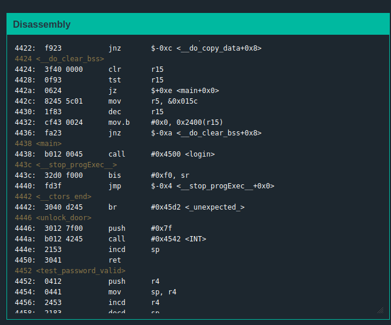
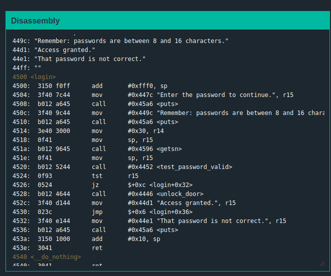
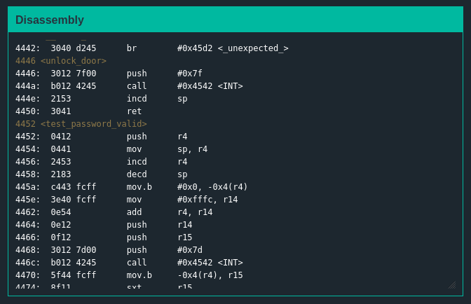
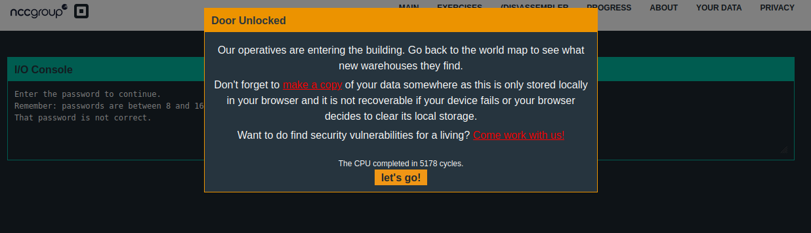

# Solution
## Analyzing the problem
+ main function  
  
The main function does not give any needed information
  
+ Other functions  
  
  
The login function is using r15 coming from the test_password_valid function and unlock_door function
  
## Approaching the problem   
I noticed that the stack pointer (sp) is at 0x43f3, which is also in the given junk password . It was 17 bytes from the start of the password buffer. Because we corrupted the stack with our user controlled data, the ret instruction will redirect to any address we place there. I gave the unlock_door’s routine that starts at 0x4446 so that it unlocks the key. I have provided a string of 16 characters, and then 2 (little endian formatted) bytes for the unlock_door routine.

## Solution
``` The password is 16 junk characters + 4644```  
