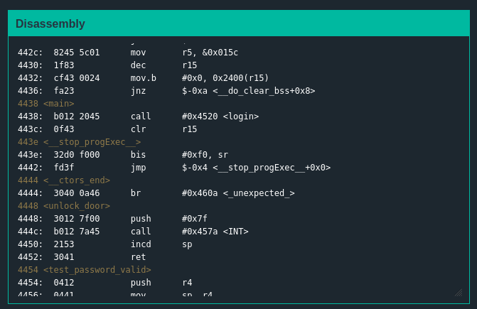
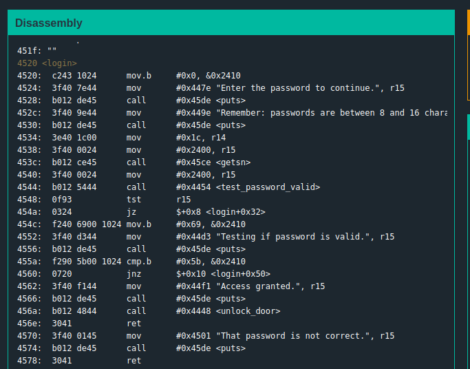
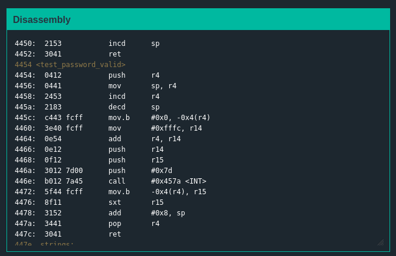
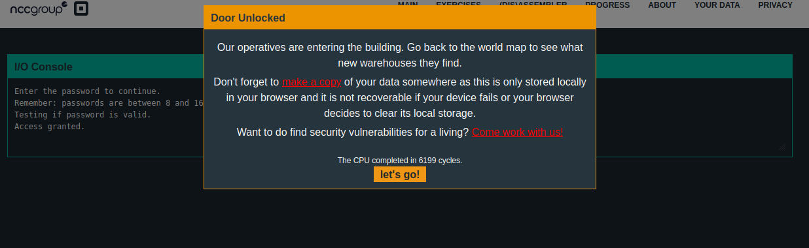

# Solution
## Analyzing the problem
+ main function  
  
The main function does not give any needed information
  
+ Other functions  
  
  
The login function is using r15 coming from the test_password_valid function
  
## Approaching the problem  
I noticed the ```455a: cmp.b #0x69, &0x2410 ```instruction in the login and realised that 0x2410 is close to the area where my password buffer was being stored in memory. I recalled the message telling us passwords are supposed to be 8 to 16 characters long. Longer password may cause overload . I took some junk 16 charaters and last character as 5b (hex) and it worked.

## Solution
``` The password is 16 junk characters + 5b```  
