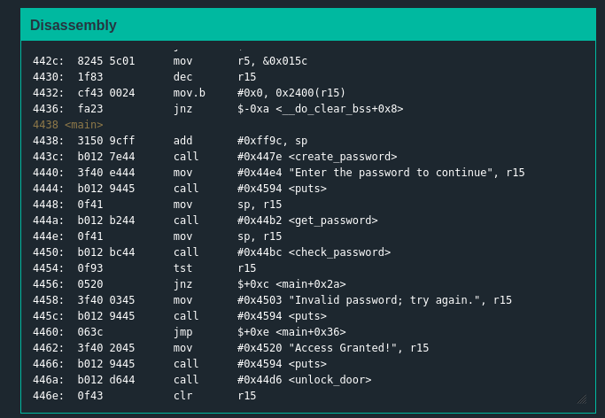
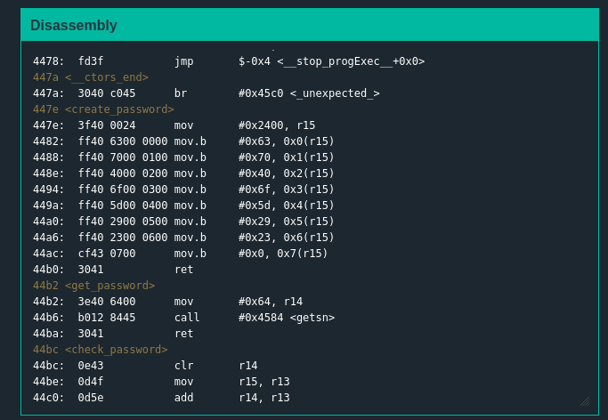
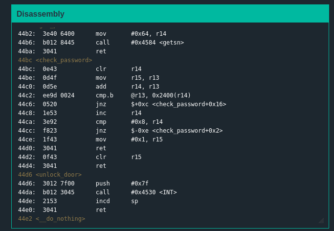
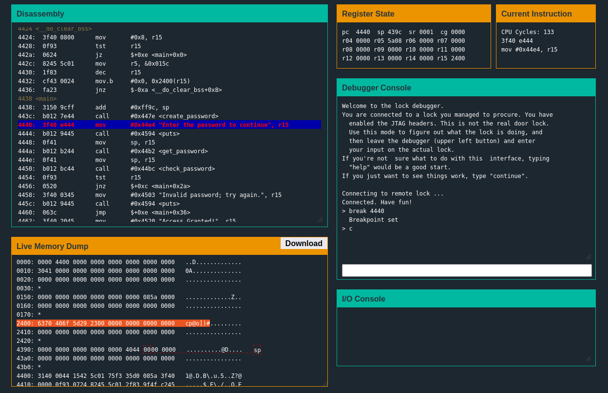
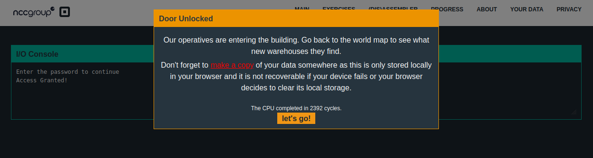

# Solution
## Analyzing the problem
+ main function  
  
The main function tells us that first we run a create_password routine, then get_password, then do a check_password. Depending on the contents of r15 once we have done that, we will jump to unlock the lock or not.  
  
+ Other functions  
  
  
We can conclude that create_password writes the password to memory, check_password just compares those bytes to the ones entered by the user.  
  
## Approaching the problem  
The password can be found in the memory after the create_password function. By using a breakpoint after it, the password can be found  
  

## Solution
``` The password is cp@o])#```  
