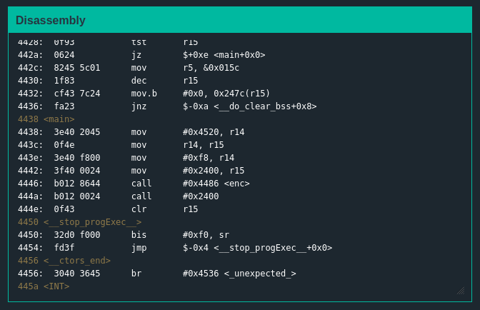
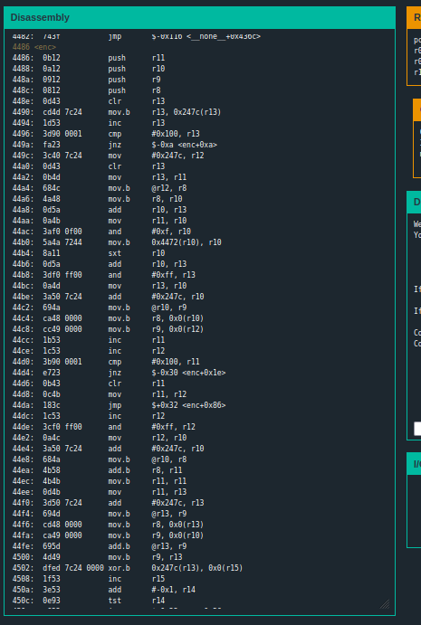
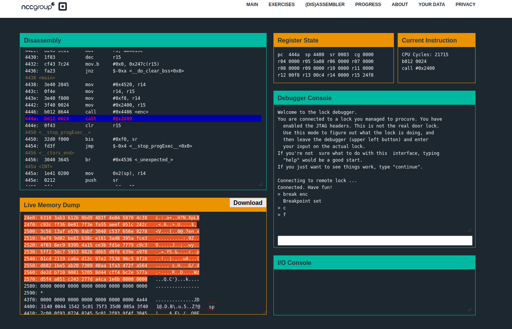
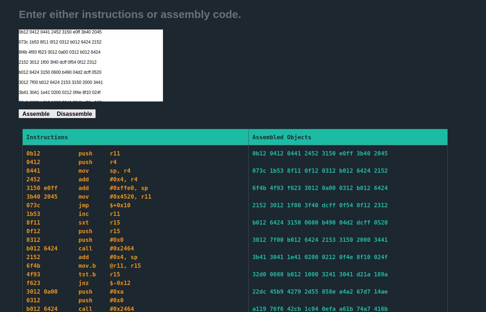
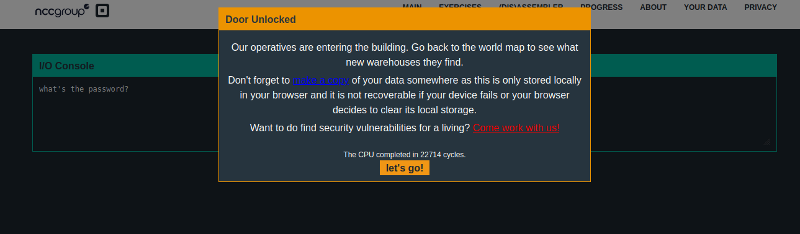

# Solution
## Analyzing the problem
+ main function  
  
The main function is not giving much information
  
+ Other functions    
  
We can conclude that password is encripted in enc function and we have to decrypt it.  
  
## Approaching the problem  
I kept breakpoints before and after the enc function and dissembled the memory stored.
  
  
The part ``` b490 04d2 dcff cmp	#0xd204, -0x24(r4) ``` looks interesting as it is comparing with d204. I tried it as solution and got it correct.
## Solution
``` The password is 04d2```  
