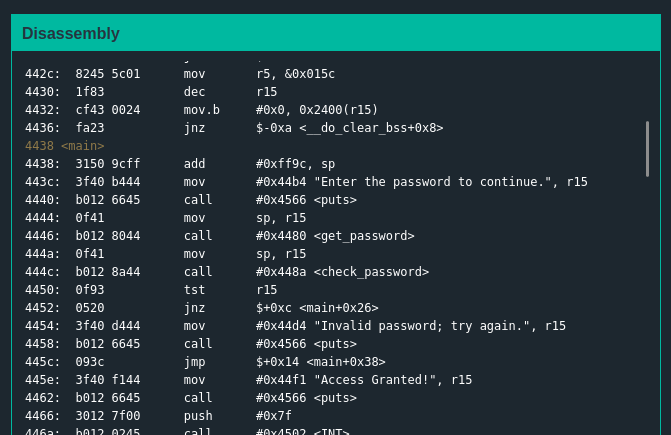
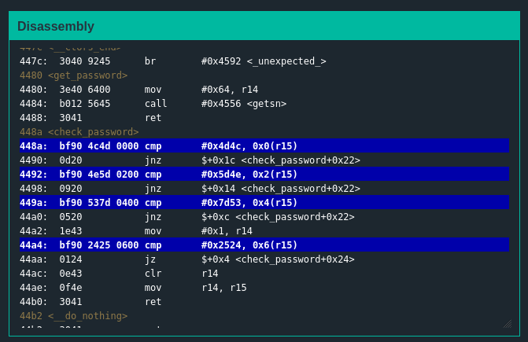
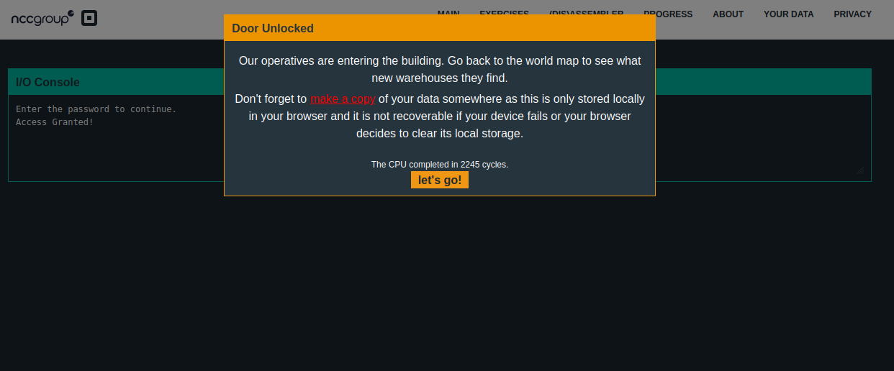

# Solution
## Analyzing the problem
+ main function  
  
The main function tells us that first we run a check_password . Depending on the contents of r15 once we have done that, we will jump to unlock the lock or not.  
  
+ Other functions  
  
We can conclude that check_password is comparing specific bytes to the ones entered by the user.  
  
## Approaching the problem  
I tried to enter the password with the specific charcters given.But it didn't work. Then I got to know that the endianness of the CPU which means it stores values in little endian format in memory. So I tried 4c4d instead of 4d4c for the first byte of password and it worked.

## Solution
``` The password is 4c4d4e5d537d2425(hex)```  
