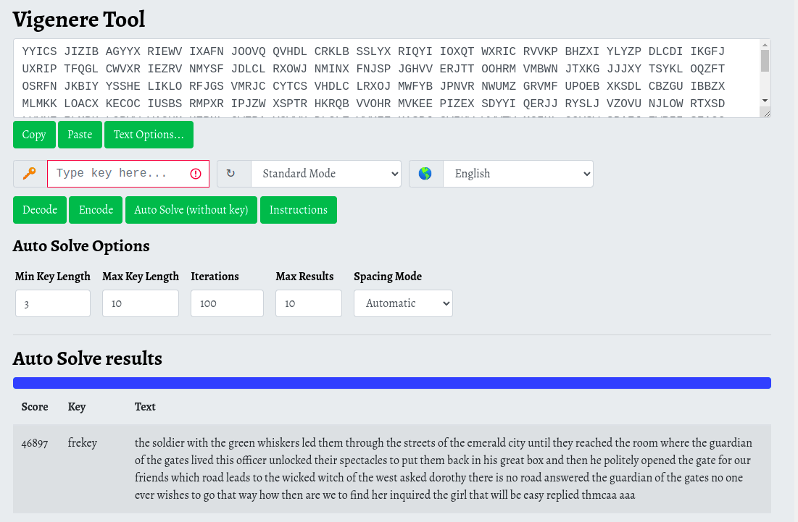

# Level 4 Walkthrough

## Password to Level 5
>CLEARTEXT

## Description
>You more than likely used frequency analysis and some common sense
to solve that one.
So far we have worked with simple substitution ciphers.  They have
also been 'monoalphabetic', meaning using a fixed key, and 
giving a one to one mapping of plaintext (P) to ciphertext (C).
Another type of substitution cipher is referred to as 'polyalphabetic',
where one character of P may map to many, or all, possible ciphertext 
characters.
An example of a polyalphabetic cipher is called a Vigen�re Cipher.  It works
like this:

If we use the key(K)  'GOLD', and P = PROCEED MEETING AS AGREED, then "add"
P to K, we get C.  When adding, if we exceed 25, then we roll to 0 (modulo 26).

P     P R O C E   E D M E E   T I N G A   S A G R E   E D
K     G O L D G   O L D G O   L D G O L   D G O L D   G O

becomes:

P     15 17 14 2  4  4  3 12  4 4  19  8 13 6  0  18 0  6 17 4 4   3
K     6  14 11 3  6 14 11  3  6 14 11  3  6 14 11  3 6 14 11 3 6  14
C     21 5  25 5 10 18 14 15 10 18  4 11 19 20 11 21 6 20  2 8 10 17

So, we get a ciphertext of:
VFZFK SOPKS ELTUL VGUCH KR

This level is a Vigen�re Cipher.  You have intercepted two longer, english 
language messages.  You also have a key piece of information.  You know the 
key length!

For this exercise, the key length is 6.  The password to level five is in the usual
place, encrypted with the 6 letter key.

>