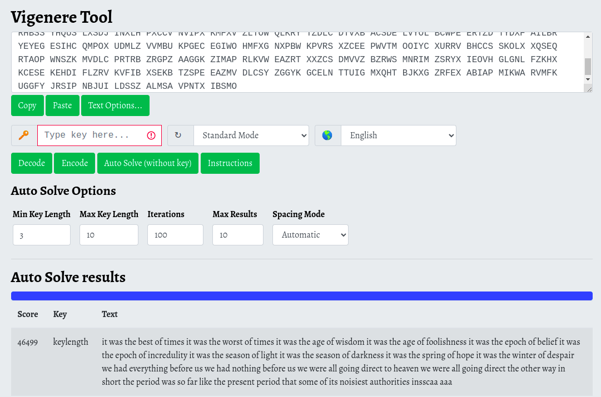

# Level 5 Walkthrough

## Password to Level 6
>RANDOM

## Description
>Frequency analysis can break a known key length as well.  Lets try one
last polyalphabetic cipher, but this time the key length is unknown.

>