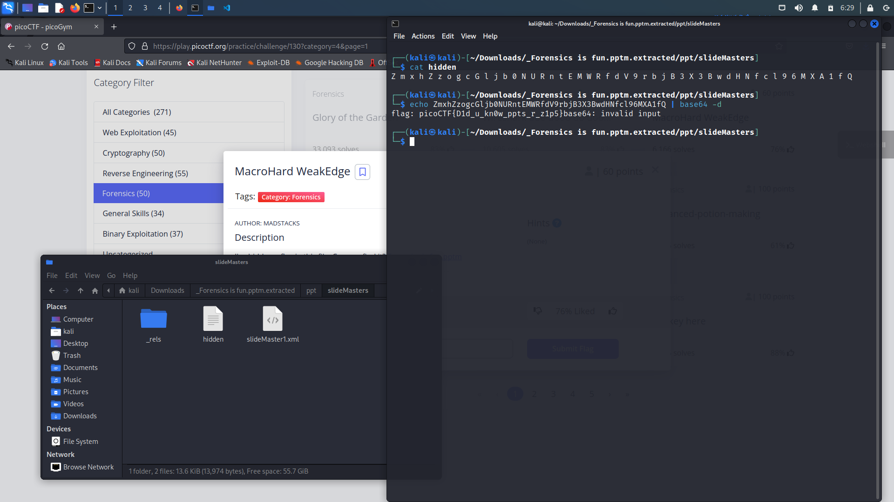

# MacroHard WeakEdge

## Overview

Points: 60 points

Category: Forensics

## Description

> I've hidden a flag in this file. Can you find it? [Forensics is fun.pptm](https://mercury.picoctf.net/static/c00c449c3b08daaccacca6f9d5c55d49/Forensics%20is%20fun.pptm)

## Hints

> (None)

## Approach

> Uncompressing `Forensics is fun.pptm` and looking in the dir, I found `hidden`, which contain `base64` encoded flag. 

## Flag

> The flag is `picoCTF{D1d_u_kn0w_ppts_r_z1p5}`
