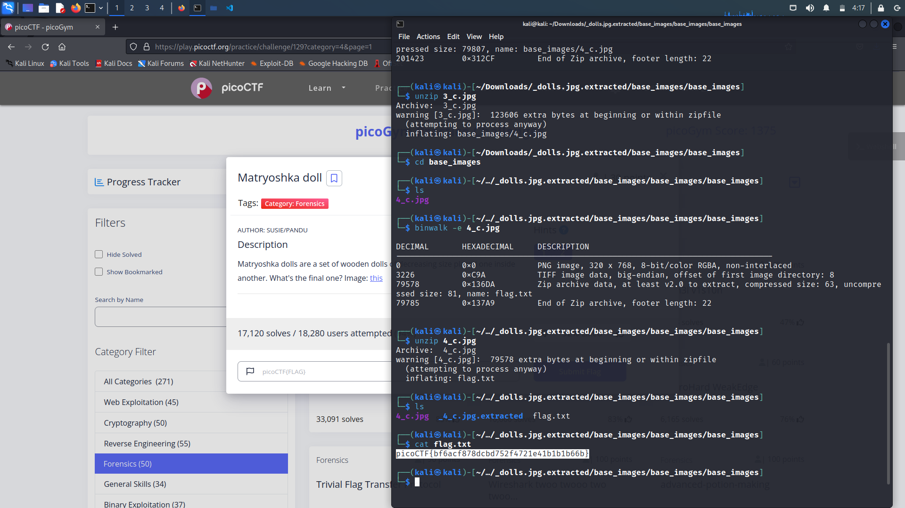

# Matryoshka doll

## Overview

Points: 30 points

Category: Forensics

## Description

> Matryoshka dolls are a set of wooden dolls of decreasing size placed one inside another. What's the final one? Image: [this](https://mercury.picoctf.net/static/1b70cffdd2f05427fff97d13c496963f/dolls.jpg)

## Hints

> + Wait, you can hide files inside files? But how do you find them?
> + Make sure to submit the flag as picoCTF{XXXXX}

## Approach

> Use `binwalk` and find that it is compressed, uncompressing it again and again, yield `flag.txt`, which contains the flag.

## Flag

> The flag is `picoCT{bf6acf878dcbd752f4721e41b1b1b66b}`
