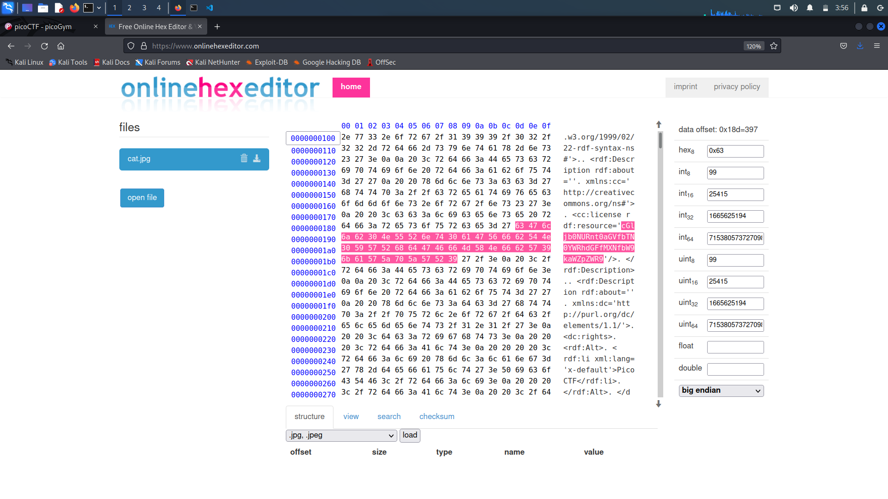

# information

## Overview

Points: 10 points

Category: Forensicss

## Description

> Files can always be changed in a secret way. Can you find the flag? [cat.jpg](https://mercury.picoctf.net/static/149ab4b27d16922142a1e8381677d76f/cat.jpg)

## Hints

> + Look at the details of the file
> + Make sure to submit the flag as picoCTF{XXXXX}

## Approach

> I check the image in a hexeditor (https://www.onlinehexeditor.com/), which gives a base64 encoded string `cGljb0NURnt0aGVfbTN0YWRhdGFfMXNfbW9kaWZpZWR9`, decoding this gives the flag. 

## Flag

> The flag is `picoCTF{the_m3tadata_1s_modified}`
