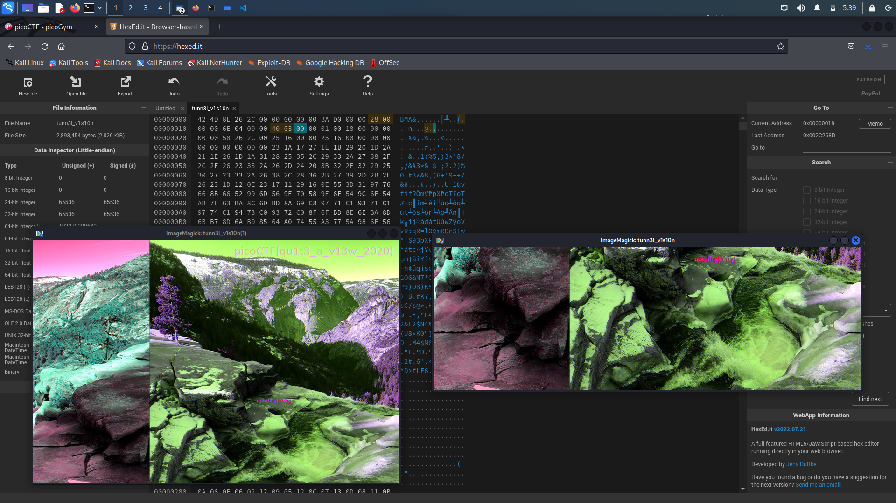

# tunn3l v1s10n

## Overview

Points: 40 points

Category: Forensics

## Description

> We found this [file](https://mercury.picoctf.net/static/21c07c9dd20cd9f2459a0ae75d99af6e/tunn3l_v1s10n). Recover the flag.

## Hints

> Weird that it won't display right...

## Approach

> Guessed that it might be an image file and opened it with `ImageMagick`, the flag was not there. Use a hexeditor to edit the `height` of `infohearder` 

## Flag

> The flag is `picoCTF{qu1t3_a_v13w_2020}`
