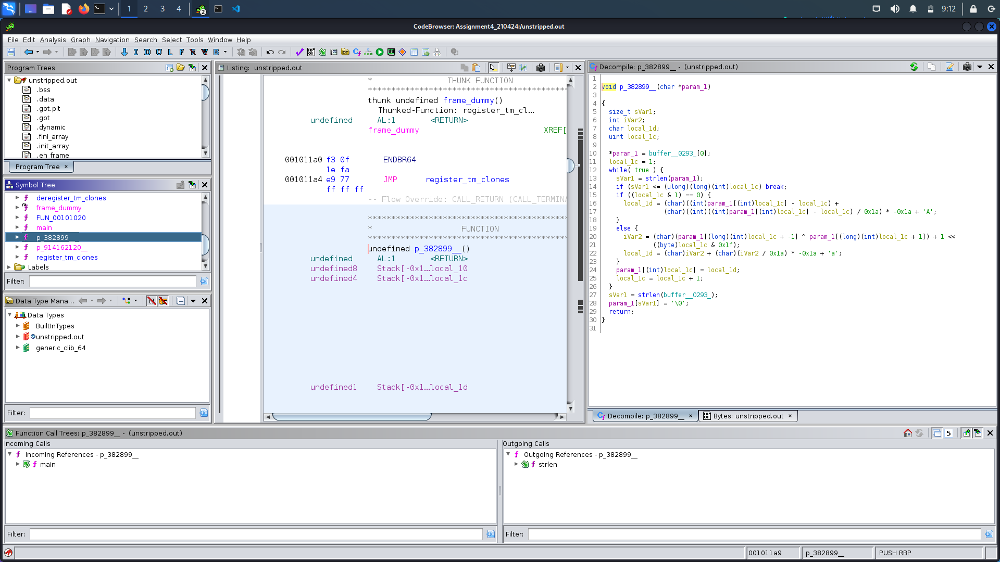
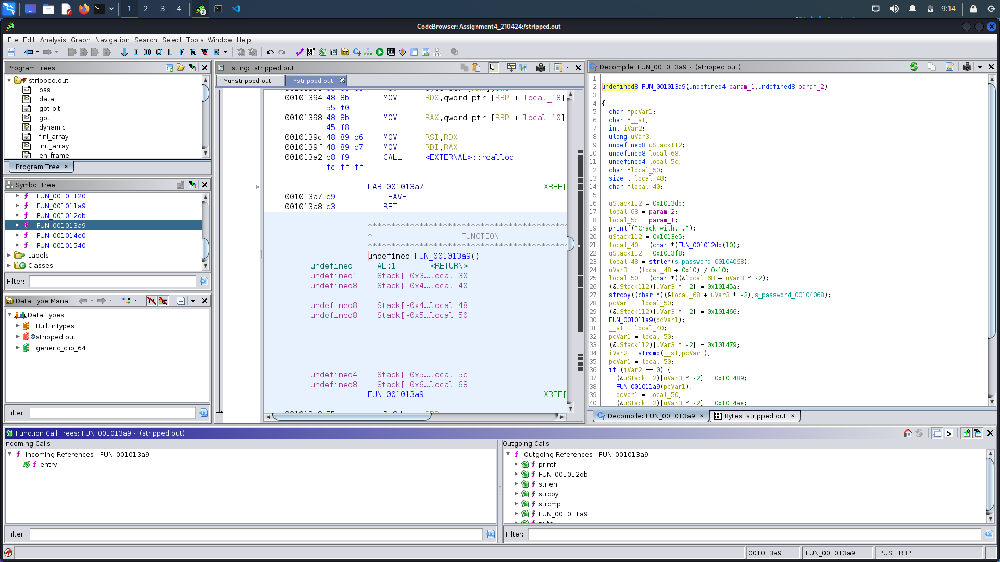

# Decompilation with Ghidra

## Passcode

> Passcode is `piJcLoEq`

## Approach with unstripped binary

> Analysing the decomplied code, we find **p_382899__** function, which on analysing yields the passcode.

## Differences between unstripped and stripped binaries

> Stripped binaries does not contain symbol table and relocation information. Given below is the **Decompiled code** of the main function of **stripped binaries** !

## Flag

> Flag is: `hackIT{passwordispoUaUyLc}`
