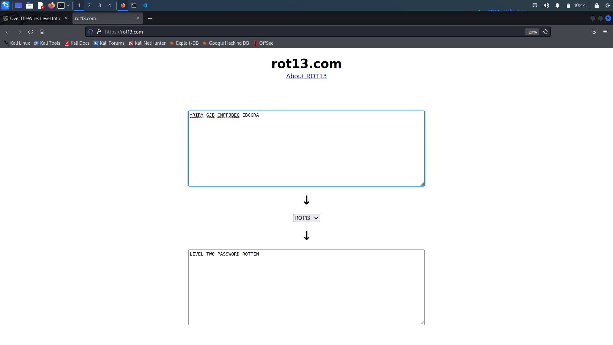

# Level 1 Walkthrough

> Use a **ROT13 decoder** to decode `YRIRY GJB CNFFJBEQ EBGGRA`

## Password to Level 2

> Password is `ROTTEN`

## Description

 README
> Welcome to Krypton!
This game is intended to give hands on experience with cryptography
and cryptanalysis.  The levels progress from classic ciphers, to modern,
easy to harder.
Although there are excellent public tools, like cryptool,to perform
the simple analysis, we strongly encourage you to try and do these
without them for now.  We will use them in later excercises.
** Please try these levels without cryptool first **
The first level is easy.  The password for level 2 is in the file
'krypton2'.  It is 'encrypted' using a simple rotation called ROT13.
It is also in non-standard ciphertext format.  When using alpha characters for
cipher text it is normal to group the letters into 5 letter clusters,
regardless of word boundaries.  This helps obfuscate any patterns.
This file has kept the plain text word boundaries and carried them to
the cipher text.
Enjoy!

 krypton2
> YRIRY GJB CNFFJBEQ EBGGRA
