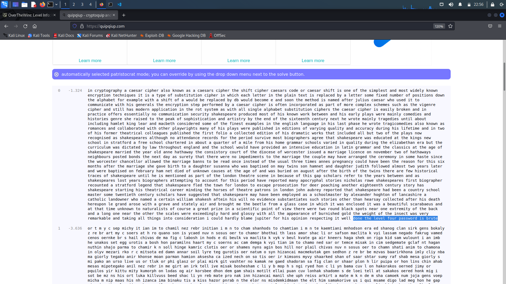

# Level 3 Walkthrough

> Use a cryptogram solver (like https://quipqiup.com/), and input *found1*, *found2*, and *found3*, to get a meaningful paragraph, use the same to solve `KSVVW BGSJD SVSIS VXBMN YQUUK BNWCU ANMJS`, which gives `DONE THE LEVEL FOUR PASSWORD IS BRUTE`

## Password to Level 4

> Password is `BRUTE`

## Description

README
> Well done.  You've moved past an easy substitution cipher.
Hopefully you just encrypted the alphabet a plaintext
to fully expose the key in one swoop.
The main weakness of a simple substitution cipher is
repeated use of a simple key.  In the previous exercise
you were able to introduce arbitrary plaintext to expose
the key.  In this example, the cipher mechanism is not
available to you, the attacker.
However, you have been lucky.  You have intercepted more
than one message.  The password to the next level is found
in the file 'krypton4'.  You have also found 3 other files.
(found1, found2, found3)
You know the following important details:
The message plaintexts are in English (*** very important)
They were produced from the same key (*** even better!)
Enjoy.

krypton4
> KSVVW BGSJD SVSIS VXBMN YQUUK BNWCU ANMJS
