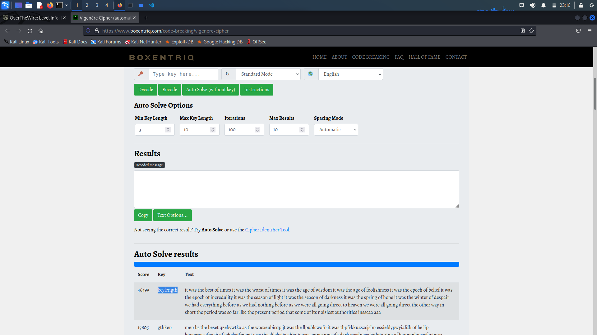
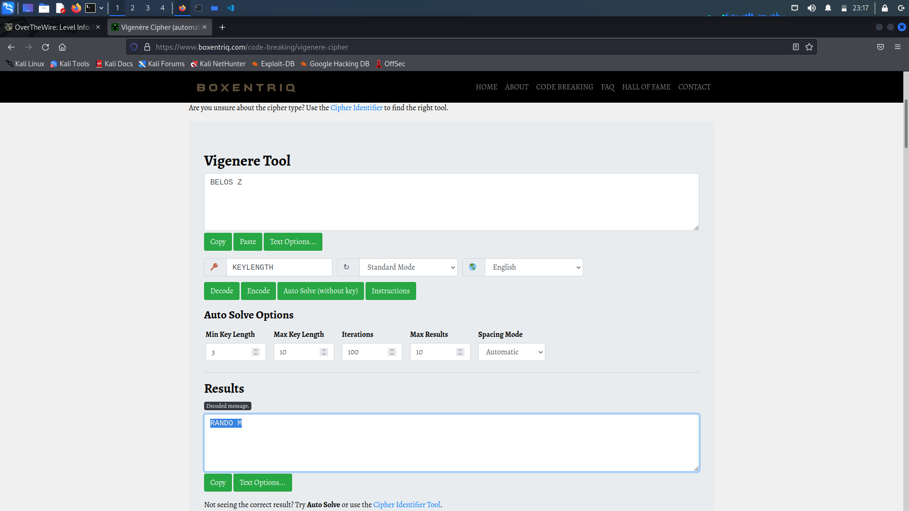

# Level 5 Walkthrough

> Use a vigenere-cipher decoder (like https://www.boxentriq.com/code-breaking/vigenere-cipher) and input *found1*, *found2* and *found3*, we find the key to be `KEYLENGTH`, use the key to decode `BELOS Z`

## Password to Level 6

> Passwoed is `RANDOM`

## Description

README
> Frequency analysis can break a known key length as well.  Lets try one
last polyalphabetic cipher, but this time the key length is unknown.
Enjoy.

krypton6
> BELOS Z