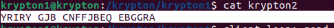

# Level 1 Walkthrough

## Password to Level 2
+ LEVEL TWO PASSWORD ROTTEN  

## Description
``` 
The first level is easy.  The password for level 2 is in the file 
'krypton2'.  It is 'encrypted' using a simple rotation called ROT13.  
It is also in non-standard ciphertext format.  When using alpha characters for
cipher text it is normal to group the letters into 5 letter clusters, 
regardless of word boundaries.  This helps obfuscate any patterns.

This file has kept the plain text word boundaries and carried them to
the cipher text.

Enjoy!
```
Decrypting the krypton2 with rot13 gives the password  



